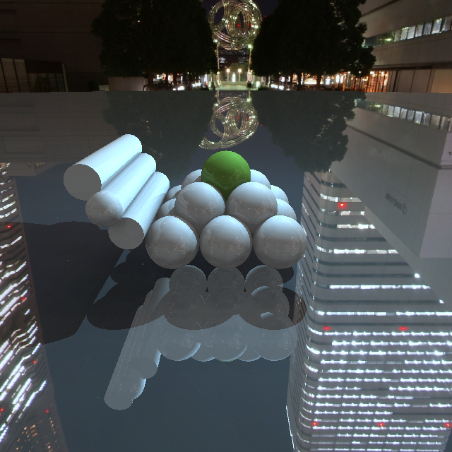
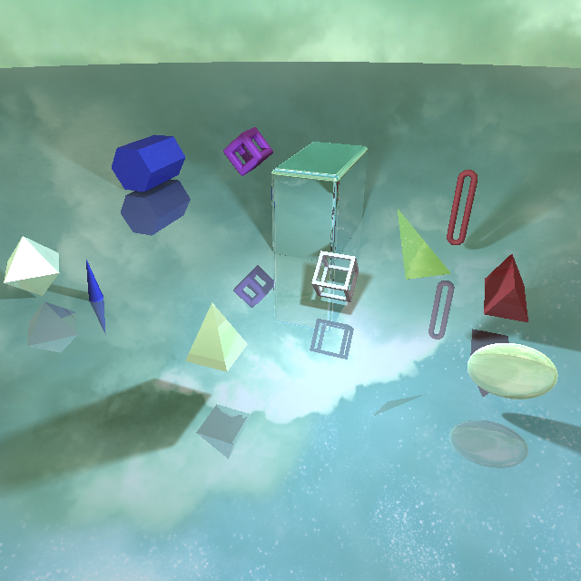
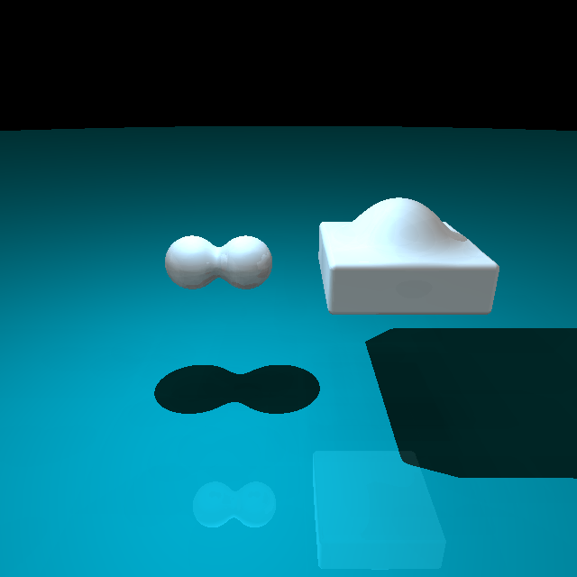
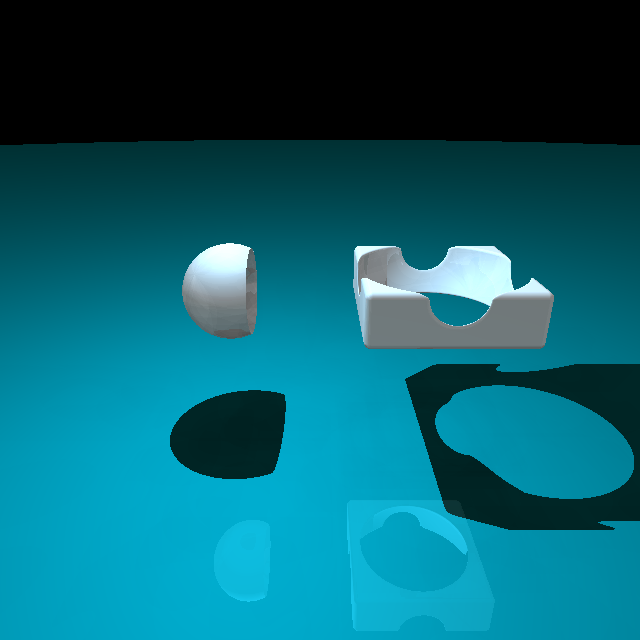
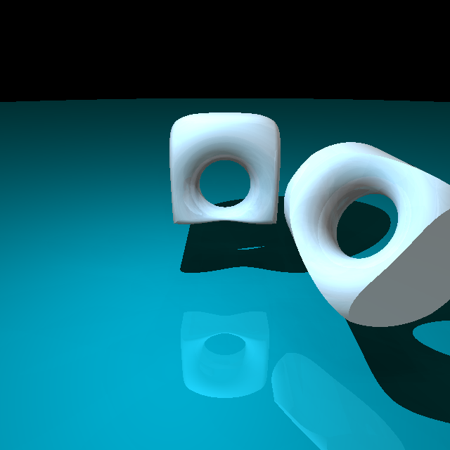
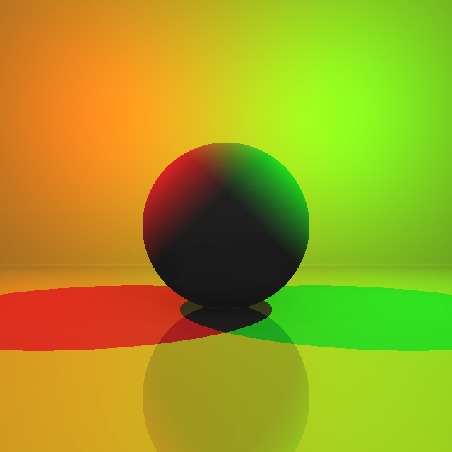
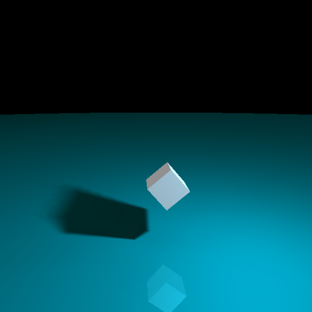
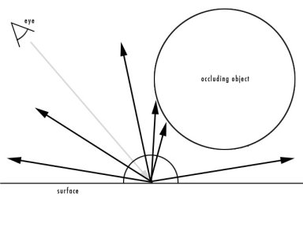
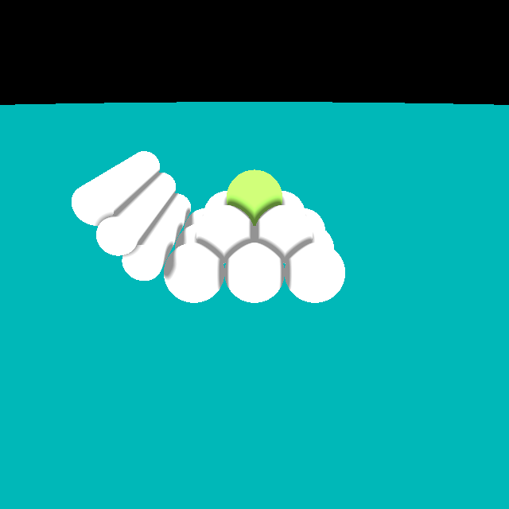
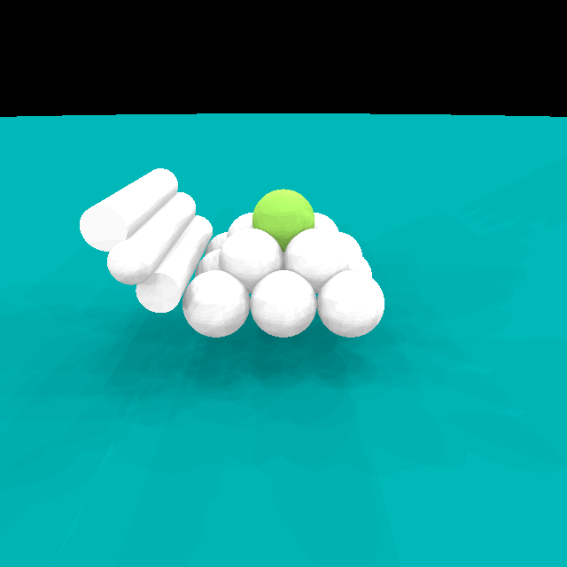

#### Group 22: Omer Farük Akgül, Bogdan Stéphane Boucher, Karl El Hajal 

## Abstract

We developed a ray marching engine in WebGL that allows users to specify scenes to be rendered in JSON format. Its architecture is based on the raytracing framework used in the course exercises, and it implements the following features:

* Adaptive ray-marching algorithm (sphere-tracing)
* Handles 16 different primitives with full control over their position and rotation. 
* Support for combinations of shapes (intersection, union, subtraction). Any two primitives can be specified in the JSON file to be combined. 
* Phong lighting and reflections.
* Soft shadows can be enabled, and the factor can be specified.
* Ambient Occlusion
* Environment Mapping can be enabled and any desired cubemap specified with 3 examples provided. 
* We further added 4 scenes where noise is raymarched to achieve aesthetic results: 3D Perlin Noise, 3D Perlin Noise + FBM, Waves, and Clouds.

## Technical Approach


### Raymarching

To achieve adaptive ray-marching, we implemented the basic sphere tracing algorithm whereas at every iteration, we call the function that calculates the shortest distance to a surface in the scene and, if that distance is not small enough, the point along the ray is advanced by that distance so as not to penetrate any surface in the scene.


This is implemented as follows:

```c
float raymarch(vec3 ray_origin, vec3 marching_direction, out int material_id) {
    float depth = MIN_DISTANCE;
    for (int i = 0; i < MAX_MARCHING_STEPS; i++) {
        float dist = scene_sdf(ray_origin + depth * marching_direction, material_id);
        
		if (dist < EPSILON) {
			return depth;
        }
        
		depth += dist;
        
		if (depth > MAX_DISTANCE) {
            return MAX_DISTANCE;
        }
    }
    return MAX_DISTANCE;
}
```


### Basic Primitives





<br/><br/>

We added to ability to specify in the JSON file 16 different primitives which are the following: Plane, Sphere, Box (+ rounded edges), Box Frame, Cylinder, Capsule, Torus, Triangle, Triangular, Link, Cone, Pyramid, Hexagonal, Ellipsoid, Octahedron.

We handled communicating the shapes from Javascript to GLSL very similarly to the exercises for performance reasons (as will be elaborated upon in the next section), and the Signed Distance Function (SDF) for each primitive was implemented with the help of the following resource: [Inigo Quilez - SDFs](https://www.iquilezles.org/www/articles/distfunctions/distfunctions.htm).

However, the aforementioned SDFs assume that the primitives are centered at the origin. Therefore, before using each one, we have to transform the position of the point from which we're checking the distance to each primitive so that it would be at the same position relative to the corresponding shape if the latter was centered at the origin.

One problem that we should mention and which we only noticed towards the end is that, for some reason, the scenes are not rendered correctly on Ubuntu machines. As we were all developing on Windows, we only noticed that too late and had no time to figure out the issue, which might possibly be due to differences in graphics drivers which lead to some detail in the implementation being incompatible with Linux systems.


### Combinations





<br/><br/>



<br/><br/>

We added the ability of adding smooth intersections, unions, or subtractions of any two primitives in JSON format directly as shown in the following example:

```json
unions: [
    {	
        material: 'white',
        smooth_factor: 0.7,
        shapes: [
            {type: 'box', center: [-1, 2, 0.1], length: 2.5, width: 2.5, height: 0.7, rotation_x: 0, rotation_y: 0, rotation_z: 0, rounded_edges_radius: 0.1, is_frame: 0},
            {type: 'sphere', center: [-1, 2, 0.5], radius: 0.8}
        ]
    },
]
```

This was very challenging since it meant that the way we were going through the primitives in the exercise session wouldn't do the trick since we cannot iterate through the shapes one primitive at a time and in any order. Our new solution involved creating a ShapesCombination struct in the shader which has information that allows us to locate each one of the two shapes:

```c
struct ShapesCombination {
	int shape1_id;
	int shape1_index;
	int shape2_id;
	int shape2_index;
	int material_id;
	float smooth_factor;
};
```

Where the shape id tells us what type of primitive the shape belongs to (e.g. shape1_id == 1 means that it's a sphere), and the shape index tells us at what index of the array of that primitive this particular shape is contained. And to be able to access each shape using the index, we had to add for each primitive a get function such as the one shown below:

```c
#if COMBINATION_NUM_SPHERES != 0
vec4 get_sphere(int sphere_index){
	for(int i = 0; i < COMBINATION_NUM_SPHERES; ++i){
		if(i == sphere_index){
			return combination_spheres_center_radius[i];
		}
	}
	return combination_spheres_center_radius[0];
}
#endif
```

While this implementation is nice in the sense that it works and allows us to set directly in the JSON format any two primitives to be combined, it has a major drawback, which is that rendering combinations is extremely slow. This is most probably due to the heavy cost of branching.
This was disappointing since this implementation alone can handle both basic primitives and combinations and yields very clean code. But due to its slowness, we opted to keep the original implementation for the primitves, and add this one to be used for combinations only since it's the only way to achieve what we wanted. 

In conclusion, this implementation allowed us to specify combinations dynamically in the JSON, but had the drawback that we had to add a lot of code on top of what we had, making it quite hefty, and is very slow.


### Lighting


We implemented basic phong lighting and reflections in the same way we did in the ray tracing exercises, so we will only elaborate on the following sections which describe novel aspects in lighting and shading.


### Soft Shadows




<br/><br/>

Soft shadows with penumbra were implemented to add better looking and more realistic shadows. They can be enabled from the JSON by adding the option, and the soft shadows factor can be specified.

The implementation was done with the help of the following reference: [Inigo Quilez - Soft Shadows](https://www.iquilezles.org/www/articles/rmshadows/rmshadows.htm).

It is a very straightforward implementation which we can benefit from since we're doing ray marching. Essentially, when computing sharp shadows, we check if the ray from a surface to the light source intersects with an object, and if it does then there's a shadow. For soft shadows, we use the fact that we are calculating distances to check how far the ray is from the object in case there's no intersection. Consequently, when the distance is very small, we want to put the point on the surface under penumbra, i.e. the smaller the distance from the surface, the darker the point should be. So with this slight modification to the code that allows us to modify the darkness of each point in this soft manner and to control it by a variable factor, we can very easily achieve nice effects such as the one seen in the image above. 


### Ambient Occlusion
<p align="center">
    <video controls width="500"> <source src="images/ao_60fps.webm" type="video/webm"></video>
</p>

We implemented Ambient Occlusion by casting from each surface point 32 rays in random directions along a hemisphere whose direction was based on the surface normal. The number of rays who intersect with surfaces are counted, and the ambient occlusion function returns the percentage of rays that have intersected. The higher that number is, the darker the spot is.



The above video gives an example of a scene rendered with the Ambient contribution only for lighting, which showcases the effects of Ambient Occlusion.

We further experimented with a "fake" Ambient Occlusion implementation which is more efficient and basically consists of casting 8 rays in fixed and predefined directions and returning a smoother result. This implementation yields similarly satisfactory results when rendering scenes with several types of lighting, essentially achieving the darkening of spots that are surrounded by several surfaces and improving the quality of the lighting in a scene. However, when the scene is rendered with the ambient contribution only, we can see that it yields wildly different results to the first implementation. While the original implementation yields a very nice and playdough-ish style, this one is only focused on heavily darkening surfaces such as edges and not affecting the rest. Both can have their uses when trying to achieve novel non-photorealistic rendering effects. A comparison is shown below with the "fake" implementation on the left, and the more involved one on the right:





<br/><br/>

\_

### Environment Mapping

<video align="left" controls width="475"> <source src="images/env_map_1_60fps.webm" type="video/webm"></video>
<video align="right" controls width="475"> <source src="images/env_map_2_60fps.webm" type="video/webm"></video>

<br/><br/>

Environment Mapping was implemented using cubemaps which were passed to the shader as a uniform samplerCube, and consequently, whenever a ray doesn't intersect with any surface, we set the color of the pixel depending on the texture's color at the corresponding position. 

Environment Mapping can be enabled from in the JSON, and any cubemap can be specified. 3 examples are provided with the source code.


### Camera Movement

We worked on moving the camera in real-time to look around the scene, but we struggled to render the scenes at a high enough framrate to make it smooth to use. Therefore, to produce some nice visuals for the video, we finally only added a simple rotation to the camera such that it orbits around the target and recorded the frames at a very slow framerate using the provided technique to record WebGL, and consequently fixed the framerate to 60 fps to get smooth videos to show.

### Noise

<video align="left" controls width="475"> <source src="images/3d_perlin_noise_60fps.webm" type="video/webm"></video>
<video align="right" controls width="475"> <source src="images/fbm_noise_60fps.webm" type="video/webm"></video>

<br/><br/>

Finally, with the help of some examples, we explored ray marching 3D noise functions and how they are used to achieve good looking visuals of all kind. 

We started by raymarching 3D Perlin noise with and without FBM to achieve very soothing effects to look at. The results are shown above, whereas we are essentially sampling the noise and playing around with the colors, varying them with position, depth and time. We were inspired by the following reference: [Exploring 3D Perlin Noise](https://www.youtube.com/watch?v=vPy7WOHs2qs)


<p align="center">
    <video controls width="500"> <source src="images/waves_60fps.webm" type="video/webm"></video>
</p>


Next, we explored producing waves by raymarching 3D noise, inspired by following: [Buoy](https://www.shadertoy.com/view/XdsGDB). We essentially significantly refactored and simplified the code and made it fit our implementation. We also used noise functions instead of sampling noise textures, and modified the results to our liking. The results are shown above.

<p align="center">
    <video controls width="500"> <source src="images/clouds_60fps.webm" type="video/webm"></video>
</p>

Finally, we attempted to produce clouds, inspired by the waves shader and a multitude of shaders which achieved all kinds of effects with the same principles, including this clouds shaders: [Clouds](https://www.shadertoy.com/view/lssGRX). We also modified it to use noise functions rather than textures, significantly simplified the code and tweaked the aesthetics and colors to our liking.


## Results

All the scenes and features mentioned above can be tested and rendered by running the WebGL source code which we have included with our deliverables and which has all the scenes pre-defined.

Further, the video below summarizes and shows off all the features described in this report, the results of which have mostly been shown in figures above.

<iframe width="420" height="315"
src="https://www.youtube.com/embed/dxjDXLZMDC8">
</iframe>

## Contributions from each team member
* Karl: Project setup and first distance function, Combinations of Primitives, Ambient Occlusion, Noise.
* Bogdan: Lighting, Shading, Reflections, Soft Shadows, Environment Mapping, Noise.
* Omer: Implementation of most distance functions, Combinations of Primitives, Camera Movement, Noise.


## References
* [Inigo Quilez - SDFs](https://www.iquilezles.org/www/articles/distfunctions/distfunctions.htm)
* [Inigo Quilez - Soft Shadows](https://www.iquilezles.org/www/articles/rmshadows/rmshadows.htm)
* [Ambient Occlusion](https://vr.arvilab.com/blog/ambient-occlusion)
* [Exploring 3D Perlin Noise](https://www.youtube.com/watch?v=vPy7WOHs2qs)
* [Buoy](https://www.shadertoy.com/view/XdsGDB)
* [Clouds](https://www.shadertoy.com/view/lssGRX)
* Code Libraries Used: regljs and gl-matrix